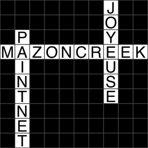

Tiny Crossword
====================================

Tiny Crossword is a daily game played publicly on Twitter. The [@TinyCrossword](https://twitter.com/TinyCrossword) account procedurally generates a 3-word puzzle at noon PST. Players (anyone on Twitter) can @-reply with their proposed solution. After two hours, the bot posts the solution and credits the first player to have solved it.

The puzzle elements are drawn from the [Simple English Wikipedia](https://simple.wikipedia.org/wiki/Main_Page) API. New puzzles are procedurally generated using up-to-date terms and concepts, with no additional designer input.

Tiny Crossword is designed to be hosted on [Heroku](https://www.heroku.com/), and uses the following open source libraries:

* [Python Imaging Library](https://github.com/python-pillow/Pillow)
* [Python-PostgreSQL Database Adapter](https://github.com/psycopg/psycopg2)
* [World Timezone Definitions](https://github.com/newvem/pytz)
* [Text-Unidecode](https://github.com/kmike/text-unidecode)
* [Twython](https://github.com/ryanmcgrath/twython)
* [Wikipedia](https://github.com/goldsmith/Wikipedia)